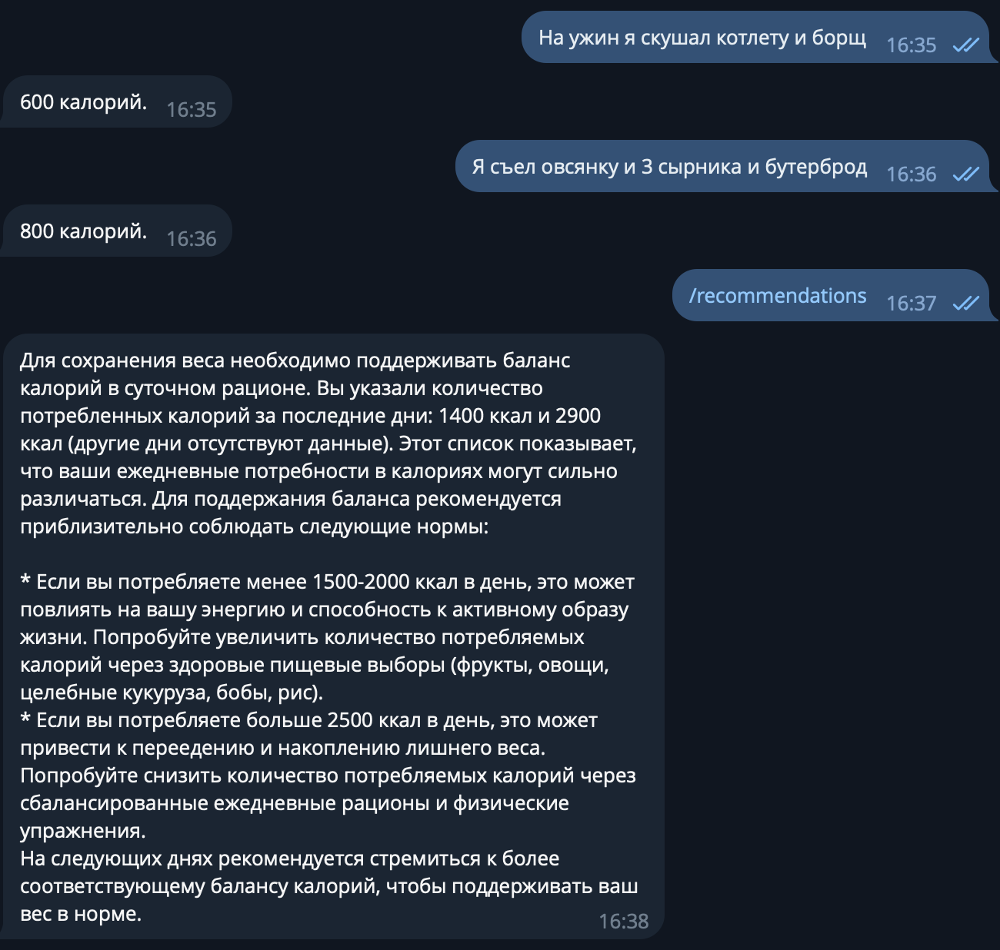
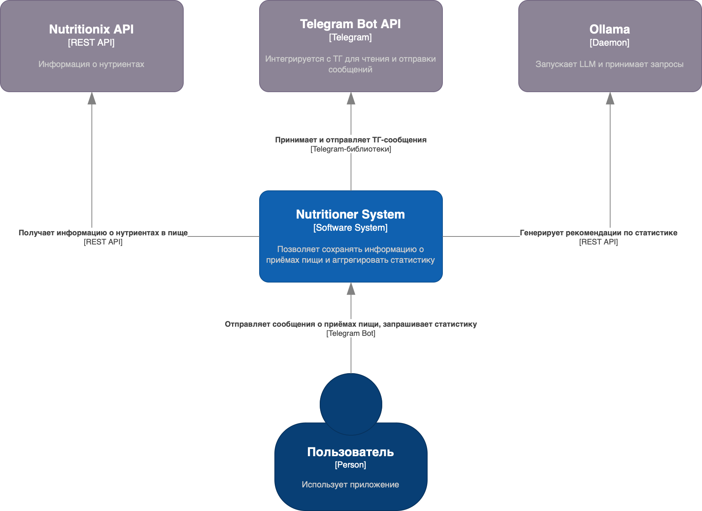
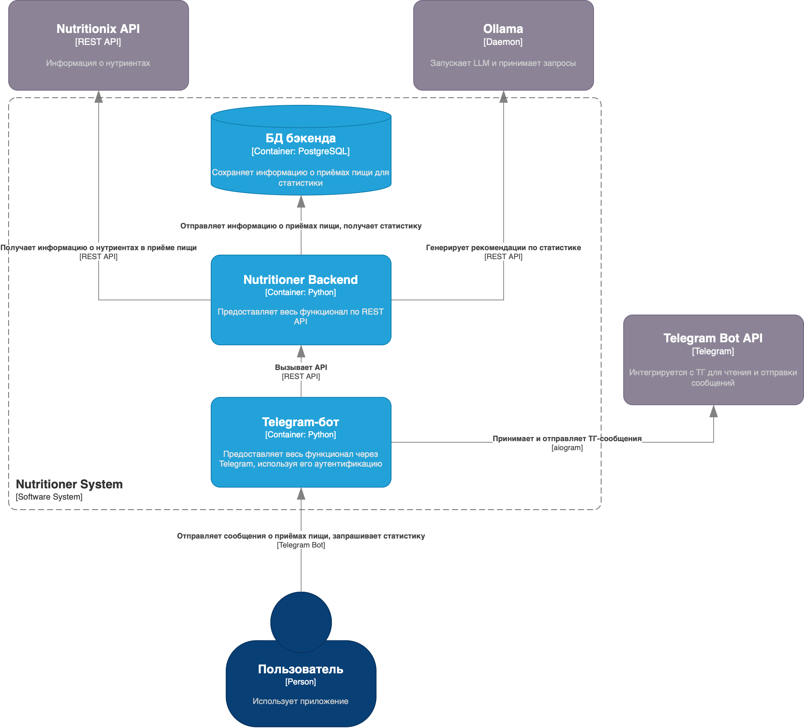

# nutritioner 

Учебный проект: Телеграм-Бот - трекер калорий с использованием ИИ. 

### Демонстрация использования


### Диаграмма C1 


### Диаграмма C2 


## Инструкция к запуску приложения

Чтобы запустить приложение, склонируйте этот репозиторий командой ```git clone``` в папку на компьютере. Далее, в корне этого склонированного проекта скопируйте `.env.example` в `.env`, измените значения на необходимые и запустите команду ```docker compose up```.
